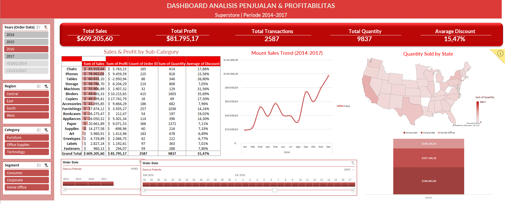

# Superstore Sales & Profitability Analysis

An Excel-based project that analyzes Superstore sales data to understand sales performance and profitability. The analysis covers sales trends, regional performance, product and customer performance, geographic distribution, and the relationship between discounts and profit.

## Project Overview

This project uses Superstore sales data from **2014–2017** to examine the company's sales and profit performance.

The analysis was conducted using **Microsoft Excel**, including data preparation, calculated fields, PivotTables, PivotCharts, and an interactive dashboard.

The final dashboard brings the main findings together and allows the data to be explored from several business perspectives.

## Business Questions

The analysis focuses on the following questions:

1. How do sales and profit change over time?
2. Which regions contribute the most to sales and profit?
3. Which product categories and sub-categories perform the best?
4. Which products generate the highest and lowest profit?
5. Which customer segments contribute the most to overall performance?
6. What patterns can be seen between discount and profit?
7. Which areas may need further attention to improve profitability?

## Dataset

The dataset contains transaction-level Superstore sales information.

### Main Variables

| Category          | Variables                                                |
| ----------------- | -------------------------------------------------------- |
| Order Information | `Row ID`, `Order ID`                                     |
| Date              | `Order Date`, `Ship Date`                                |
| Shipping          | `Ship Mode`                                              |
| Customer          | `Customer ID`, `Customer Name`, `Segment`                |
| Location          | `Country`, `City`, `State`, `Postal Code`, `Region`      |
| Product           | `Product ID`, `Category`, `Sub-Category`, `Product Name` |
| Sales             | `Sales`, `Quantity`, `Discount`                          |
| Profitability     | `Profit`, `Profit Margin`                                |

### Calculated Field

A `Profit Margin` field was added to compare profit relative to sales and provide an additional measure of profitability.

## Data Preparation

The dataset was prepared in Microsoft Excel before creating the analysis and dashboard.

The main steps included:

* Reviewing the transaction data
* Preparing the sales and profit variables
* Adding the `Profit Margin` calculated field
* Organizing variables for PivotTable analysis
* Creating summary tables for sales, profit, transactions, quantity, and discount
* Preparing the results for dashboard visualizations

## Analysis

The analysis was divided into several areas to provide a broader view of business performance.

### 1. Regional Performance

The four regions were compared based on sales, profit, number of transactions, quantity sold, and average discount.

| Region   |           Sales |         Profit | Transactions |
| -------- | --------------: | -------------: | -----------: |
| **West** | **$187,480.18** | **$24,051.61** |      **805** |
| East     |     $180,685.82 |     $20,141.60 |          766 |
| Central  |     $147,429.38 |     $19,899.16 |          603 |
| South    |      $93,610.22 |     $17,702.81 |          413 |

**Key observation:** West recorded the highest sales and profit among the four regions.

### 2. Category Performance

The three product categories were compared using sales, profit, transaction volume, quantity, and average discount.

| Category        |           Sales |         Profit | Transactions | Avg. Discount |
| --------------- | --------------: | -------------: | -----------: | ------------: |
| Furniture       |     $198,901.44 |      $6,959.95 |          562 |        17.69% |
| Office Supplies |     $183,939.98 |     $35,061.23 |        1,566 |        15.21% |
| **Technology**  | **$226,364.18** | **$39,773.99** |      **459** |    **13.66%** |

**Key observation:** Technology recorded the highest sales and profit, while also having the lowest average discount among the three categories.

### 3. Sub-Category Performance

Sub-categories were compared using sales, profit, number of orders, quantity, and average discount.

Some of the main findings were:

* **Chairs** recorded the highest sales at **$83,918.64**.
* **Copiers** generated the highest profit at **$17,742.79**.
* **Tables** recorded the largest negative profit at **-$2,950.94**.
* **Supplies** also recorded a negative profit of **-$698.96**.
* **Binders** had the highest average discount at **35.69%**.

The results show that high sales do not necessarily result in high profitability.

### 4. Sales Trend

Monthly sales were analyzed to see how sales changed throughout the 2014–2017 period.

The dashboard includes a **Monthly Sales Trend** that allows monthly performance to be compared more easily.

In the monthly summary, **December recorded the highest sales at $96,999.04**.

### 5. Customer Segment

The dataset contains three customer segments:

* Consumer
* Corporate
* Home Office

The dashboard compares these segments to show their contribution to overall sales performance.

### 6. Geographic Analysis

Geographic performance was analyzed at both regional and state levels.

The dashboard includes a **Quantity Sold by State** map to show the distribution of products sold across the United States.

### 7. Discount and Profitability

Discount levels were compared with sales and profit to identify patterns that may be related to profitability.

Some differences can be seen across regions and categories:

* Central had the highest average regional discount at **22.21%**.
* West had the lowest average regional discount at **11.72%**.
* Technology had the lowest average category discount at **13.66%** while generating the highest category profit.

These results describe patterns in the dataset but do not establish a causal relationship between discount and profit.

## Dashboard

An interactive Excel dashboard was created to summarize the main results.

### Key Performance Indicators

| KPI                    |           Value |
| ---------------------- | --------------: |
| **Total Sales**        | **$609,205.60** |
| **Total Profit**       |  **$81,795.17** |
| **Total Transactions** |       **2,587** |
| **Total Quantity**     |       **9,837** |
| **Average Discount**   |      **15.47%** |

### Dashboard Components

The dashboard includes:

* Sales & Profit by Sub-Category
* Monthly Sales Trend
* Quantity Sold by State
* Sales by Customer Segment
* Year filter
* Region filter
* Category filter
* Segment filter
* Order Date filter

These filters allow the dashboard to be viewed based on different years, regions, categories, customer segments, and order dates.

## Key Business Insights

The analysis resulted in several notable findings:

1. **West was the strongest region**, recording the highest sales and profit among the four regions.
2. **Technology was the strongest category**, with the highest sales (**$226,364.18**) and profit (**$39,773.99**).
3. **Chairs recorded the highest sales among sub-categories**, while **Copiers generated the highest profit**.
4. **Tables showed a profitability issue**, generating **-$2,950.94** in profit despite having **$60,833.20** in sales.
5. **Discount levels varied across regions and categories**, which may be worth examining further when evaluating profitability.
6. The analysis shows that **sales alone do not fully represent business performance**. Profit and discount are also important when evaluating products and regions.

## Tools Used

* **Microsoft Excel**

  * Data preparation
  * Calculated fields
  * PivotTables
  * PivotCharts
  * Interactive filters
  * Dashboard visualization

## Project Structure

```text
superstore-sales-profitability/
│
├── README.md
├── SUPERSTORE.xlsm
└── images/
    └── dashboard.png
```

## Project Objective

The main objective of this project is to use transaction-level sales data to better understand business performance.

The analysis combines sales, profit, product, customer, geographic, time, and discount information to identify strong-performing areas and areas that may require further attention.
